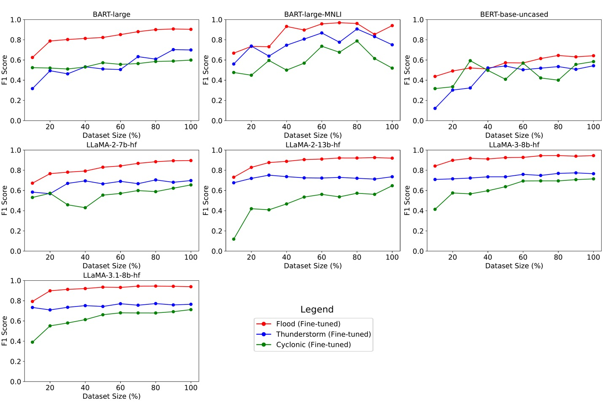
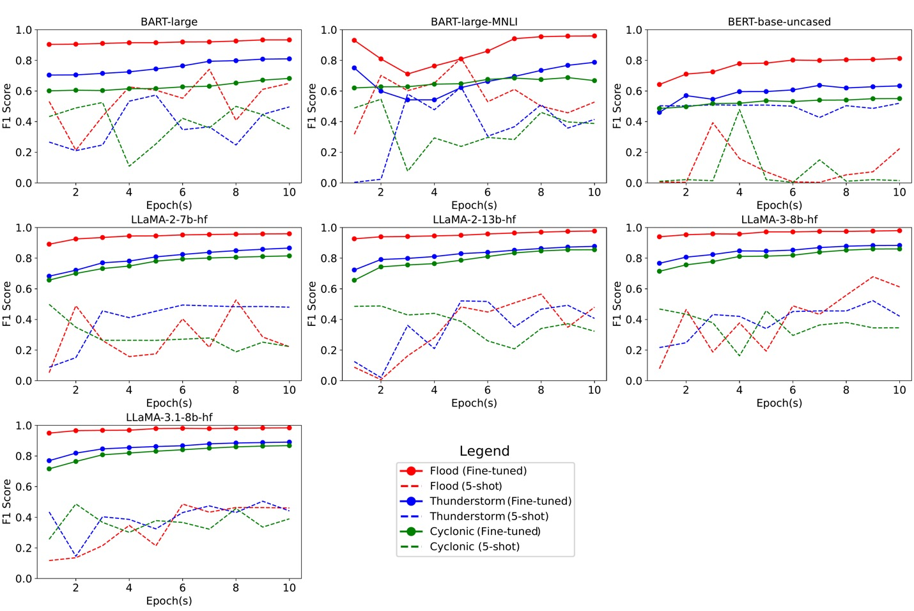
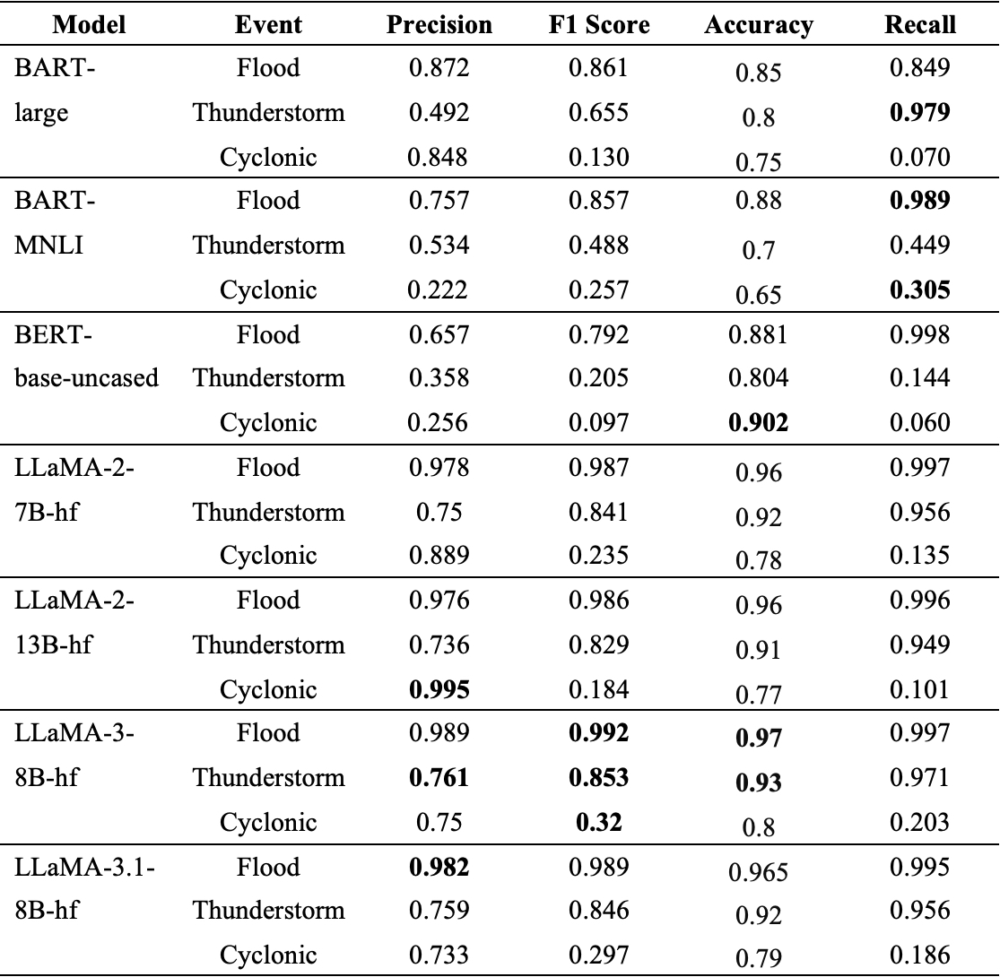
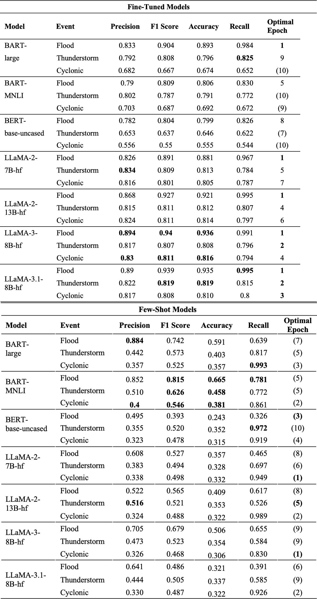

# HydroLLMs

**Can Large Language Models Effectively Reason about Adverse Weather Conditions?**

Welcome to **HydroLLMs**, a repository dedicated to sharing the **research findings, codebase, and evaluation** framework from our comprehensive study on the reasoning capabilities of Large Language Models (LLMs) when classifying adverse weather events using real-world disaster reports.

This repository provides a **complete and transparent workflow**—from data acquisition and preprocessing to fine-tuning and evaluation of multiple LLM architectures. It also includes practical insights into optimizing training efficiency and model stability, aiming to serve as a reference for **researchers, developers, and disaster management** practitioners interested in applying LLMs to text-based hazard analytics.

## Table of Contents

- [Overview](#overview)
- [Key Findings](#key-findings)
- [Dataset](#dataset)
- [Models Evaluated](#models-evaluated)
- [Usage](#usage)
- [Citation](#citation)

## Overview

HydroLLMs investigates the performance of seven transformer-based LLMs—including **BART, BERT, LLaMA-2, and LLaMA-3** models—on multi-label classification of **over 19 years of National Weather Service (NWS)** flood reports from Charleston County, South Carolina. The study focuses on three critical disaster categories: 

- Flood, 

- Thunderstorm, 

- and Cyclonic.

## Key Findings

**Figure 1 — Dataset Size vs Model Performance**

F1-score trends show how each model responds to increasing training data.

While most models **required 80–100% of the dataset** for peak performance, **LLaMA-3 models** reached optimal F1-scores with only ~60%, demonstrating **superior data efficiency**.

  

**Figure 2 — Epoch-Wise Stability Across Models**

Comparison of model performance over 10 training epochs.

**LLaMA-3.1 and LLaMA-3 models** converged in just 3–4 epochs, outperforming **BERT and BART** in stability and early accuracy.

  

**Table 1 — Model Performance on Imbalanced Dataset**

**LLaMA-3.1-8B-hf** achieved an **F1-score of 0.99**2 for the Flood category and **>0.84 for Thunderstorm**.

Performance in the Cyclonic category remained low across models due to data scarcity.

  

**Table 2 — Optimal Epochs for F1 ≥ 0.8**

Highlights the minimum number of epochs each model required to reach **high classification performance**.

**LLaMA-3 models consistently required the fewest epochs**, making them ideal for **real-time or resource-constrained environments**.

## Dataset

**Source:** National Weather Service (NWS) flood reports (2004–2023).

**Scope:** Labeled text data for Flood, Thunderstorm, and Cyclonic events.

**Challenge:** Class imbalance (e.g., Cyclonic as minority class).

## Models Evaluated

Model Family	Variants Tested

LLaMA-3	----> 8B-hf, 70B-hf

LLaMA-2	----> 7B, 13B

BERT	----> base-uncased

BART	----> large, MNLI

## Usage

To replicate our analysis:

git clone https://github.com/Clemson-Hydroinformatics-Lab/HydroLLMs  
pip install -r requirements.txt  
python train.py --model=Model Flag --dataset=nws_floods  

Model Flag | Corresponding HuggingFace Model ID

bart-large | facebook/bart-large

bart-mnli | facebook/bart-large-mnli

bert-base | google-bert/bert-base-uncased

llama2-7B | meta-llama/Llama-2-7b-hf

llama2-13B | meta-llama/Llama-2-13b-hf

llama3-8B | meta-llama/Llama-3-8B-hf

llama3.1-8B | meta-llama/Llama-3.1-8B-hf

## Citation

Zafarmomen, N., & Samadi, V. (2025). Can large language models effectively reason about adverse weather conditions?. Environmental Modelling & Software, 188, 106421. DOI: https://doi.org/10.1016/j.envsoft.2025.106421
